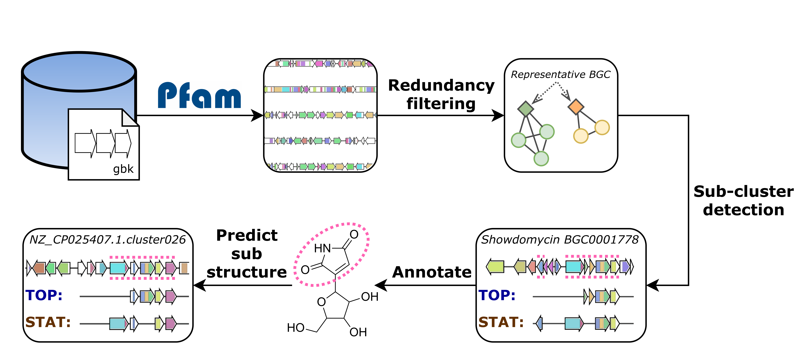

# iPRESTO

iPRESTO (integrated Prediction and Rigorous Exploration of biosynthetic
Sub-clusters Tool)
is a collection of python scripts for the detection of gene sub-clusters in
a set of Biosynthetic Gene Clusters (BGCs) in GenBank format. BGCs are tokenised
by representing each gene as a combination of its Pfam domains, where subPfams
are used to increase resolution. Tokenised BGCs are filtered for redundancy
using similarity network with an Adjacency Index of domains as a distance metric.
For the detection of sub-clusters two methods are used: PRESTO-STAT, which is
based on the statistical algorithm from Del Carratore et al. (2019), and the
novel method PRESTO-TOP, which uses topic modelling with Latent Dirichlet
Allocation. The sub-clusters found with iPRESTO can then be linked to Natural
Product substructures.

Developed by Joris Louwen.
Supervisors: Marnix Medema (PI), Justin van der Hooft and Satria Kautsar.
All from the Bioinformatics group at Wageningen University. 

{:height="50%" width="50%"}